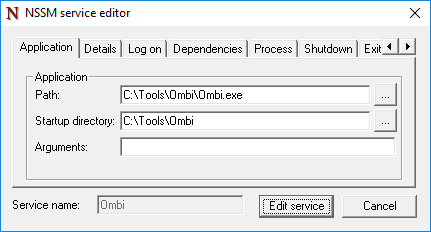

# Installation

__Note__: After installing the system, be sure to configure your own systems to handle the requests after approval.  
Any requests made without an endpoint to receive it will not be able to be re-processed at this point.  
Whatever combination of the supported systems you use is up to you - Sonarr, Radarr, Couchpotato, Lidarr... Whatever.  

For a guide on updating, see [Update Settings](../updating)  
For considerations when migrating an existing install rather than starting fresh, see [Migrating Systems](#migrating-systems)

***

## Recommended install workflow

1. Install Ombi for your preferred OS using the steps provided below.  
If you are migrating systems, rather than starting fresh, stop here and look at [Migrating Systems](#migrating-systems).
1. Configure your [install-specific settings](../../settings/customization) like the application url you'll be using externally.
1. Configure external access to Ombi. We recommend using SSL and a [reverse proxy](../../info/reverse-proxy).
1. Configure notification methods and system connections (Sonarr, Radarr, etc).  
Ensure you have systems to handle approved requests _before_ you give users access to the system.
1. [Import users](../../settings/usermanagement) and [assign permissions](../../info/user-roles).

## Migrating Systems

If you're migrating Ombi from an existing install to a new install, the install process itself is exactly the same as below - with one exception, regardless of what you're migrating from or to.  
Depending on what database you're using, you will need to keep the following files:  

=== "SQLite"
    * `Ombi.db`
    * `OmbiExternal.db`
    * `OmbiSettings.db`

=== "MySQL"
    * `database.json`

=== "MariaDB"
    * `database.json`

When it comes time to actually launch Ombi on your fresh installation, place the relevant files into the new Ombi directory (wherever you may have put it), and *then* launch Ombi. This way Ombi will load with all of your prior settings, customisations, users, and synced data (so it doesn't require a full re-sync with Plex).  
If you are running docker, place these files into the folder you've passed into the container as "/config" for the installation to find them.  
***

## Windows

=== "V4"
    1. Download the latest `win10-xxx.zip` (x64 or x86 depends on your system) from [Ombi Releases](https://github.com/Ombi-app/Ombi/releases/latest)
    1. Right click the file > Properties > Unblock
    1. Extract the zip to your preferred directory.  
    **DO NOT** place in the "Program Files" or "ProgramData" folders as the Ombi database will be locked.
    1. Run Ombi.exe

=== "V4 (Develop)"
    1. Download the latest `win10-xxx.zip` (x64 or x86 depends on your system) from [Ombi Releases](https://github.com/Ombi-app/Ombi/releases)
    1. Right click the file > Properties > Unblock
    1. Extract the zip to your preferred directory.  
    **DO NOT** place in the "Program Files" or "ProgramData" folders as the Ombi database will be locked.
    1. Run Ombi.exe

### Install as a Service

(This is the preferred method on Windows)

1. Download the latest `win10-xxx.zip` (x64 or x86 depends on your system) from [Ombi Releases](https://github.com/Ombi-app/Ombi/releases)
1. Right click > Properties > Unblock
1. Extract the zip to your preferred directory.  
In the example configs below, we've put the contents of the archive into `C:\Tools\Ombi`.
**DO NOT** place in the "Program Files" or "ProgramData" folders as the Ombi database will be locked.
1. Use [NSSM](https://nssm.cc/) to manage Ombi.  
(Download either the 32-/64-bit version, extract the archive, then put the `nssm.exe` file into `C:\Windows\system32`.)
1. Open command prompt as an Administrator, type `nssm install Ombi`, then press ++enter++  
Use one of the below settings depending on whether you want to keep or change the default port.
1. Click "Install service"
1. In your command prompt window, type `net start Ombi` and press ++enter++
1. Wait 10-20 seconds for Ombi to start up, then open a web browser.
1. Ombi should now be reachable at [http://localhost:5000](http://localhost:5000).

=== "Standard Setup"
    Be sure to adjust directories to your Ombi install location

    **Path:** `C:\Tools\Ombi\Ombi.exe`  
    **Start directory:** `C:\Tools\Ombi`

    {: loading=lazy }  

=== "Alternate port number"
    Be sure to adjust directories to your Ombi install location

    **Path:** `C:\Tools\Ombi\Ombi.exe`  
    **Start directory:** `C:\Tools\Ombi`  
    **Arguments:** `--host "http://*:PORTNUMBER"`

    {: loading=lazy }  

### Install as a scheduled task

As an alternative to NSSM, you can use Task Scheduler to run `Ombi.exe` as if you were double clicking it and running it like a regular executable, except it's hidden from the task bar and can only be closed by the Task Manager or the Task Scheduler.

1. Open 'Task Scheduler' either search for it in start. Or simply Run... ++win+r++  `%windir%\system32\taskschd.msc`
1. Click `Create task...` on the right hand side.
1. Give the task a name. _Example:_ Ombi And a description if you want. (Not necessary)
1. Check `Run with highest privileges`
1. Click `Run whether user is logged on or not` to ensure Ombi runs even when you are logged out!
1. Check `Hidden`
1. Configure for: Choose your Windows version.
1. Click the `Triggers` Tab and click `New...`
1. `Begin the task:` 'At system startup. `Click` OK`
1. Click the `Actions` Tab and Click `New...`
1. Click `Browse...` and navigate to your `Ombi.exe` Click `Open`
1. Fill `Start in (optional):` with `Ombi.exe`'s working directory. IE: `C:\Ombi\` or `C:\SERVERS\Ombi\` basically, wherever you extracted your 'Ombi' folder to and where it lives. Click `OK`
1. `Settings Tab` Un-tick `Stop the task if it runs longer than:` Click `OK`
1. You will be prompted for your windows user name and password. Please enter your credentials and click `OK`
1. Click `Task Scheduler Library` right click on your new task and hit run. give it a good 20-30 seconds to start.  Ombi should now be reachable at [http://localhost:5000](http://localhost:5000) !

**_Note: The next time you restart your PC, Task Scheduler will run ombi for you._**

#### Scheduled task (with pictures)

[How to WITH PICTURES!](../schedule-with-pictures)

### Windows Firewall

To allow a port through Windows Firewall, you have a few options.
Note that this is not the preferred method of access, and a [Reverse Proxy](../../info/reverse-proxy) is recommended instead.  
Replace the port in the below commands with your own port if you're running a different port than the default.  

=== "Command Prompt"

    ```batch
    netsh advfirewall firewall add rule name="Ombi" dir=in action=allow protocol=TCP localport=5000
    ```

=== "Powershell"

    ```powershell
    New-NetFirewallRule -DisplayName 'Ombi' -Direction Inbound -Action Allow -Protocol TCP -LocalPort @('5000')
    ```

***

## Linux systems

### Debian / APT repo

**Note:** This is the easy way, and only works with Debian-based distributions.  
Also note that only systemd is supported, not upstart. That means Debian jessie and up, and Ubuntu 15.04 and up.  
**Note 2:**  We are in the process of changing repo providers. Bear with us.  
**Note 3:**  Apt-Key has been deprecated in Ubuntu 21.xx onwards. Use the v4 (21.xx) method below for this OS.

=== "V4 (Develop)"
    1. Add the apt repository to the apt sources list:  
    `echo "deb https://apt.ombi.app/develop jessie main" | sudo tee /etc/apt/sources.list.d/ombi.list`  
    2. This repo is signed. This means packages get validated before installation. So, to safely download and install Ombi packages, the Ombi key needs to be installed:  
    `curl -sSL https://apt.ombi.app/pub.key | sudo apt-key add -`  
    3. Update the package list and install Ombi:  
    `sudo apt update && sudo apt install ombi`

=== "V4 (Stable)"
    _Note that this is the 'slow' ring. Fixes and features get pushed to V4 (Develop) much more rapidly than Stable._  
    1. Add the apt repository to the apt sources list:  
    `echo "deb https://apt.ombi.app/master jessie main" | sudo tee /etc/apt/sources.list.d/ombi.list`  
    2. This repo is signed. This means packages get validated before installation. So, to safely download and install Ombi packages, the Ombi key needs to be installed:  
    `curl -sSL https://apt.ombi.app/pub.key | sudo apt-key add -`  
    3. Update the package list and install Ombi:  
    `sudo apt update && sudo apt install ombi`

=== "V4 (PackageCloud)"
    _Note that this is for Ubuntu 20.xx onwards, and on the development branch, **and** on the new repo._  
    1. Add the apt repository to the apt sources list:  
    ```bash
    echo "deb [arch=amd64 signed-by=/usr/share/keyrings/ombi-archive-keyring.gpg] https://packagecloud.io/Ombi-app/Ombi/debian/ jessie main" | sudo tee /etc/apt/sources.list.d/ombi.list
    echo "deb-src [arch=amd64 signed-by=/usr/share/keyrings/ombi-archive-keyring.gpg] https://packagecloud.io/Ombi-app/Ombi/debian/ jessie main" | sudo tee -a /etc/apt/sources.list.d/ombi.list
    ```  
    2. This repo is signed. This means packages get validated before installation. So, to safely download and install Ombi packages, the Ombi key needs to be installed:  
    `sudo curl -sSL https://packagecloud.io/Ombi-app/Ombi/gpgkey | gpg --dearmor > /usr/share/keyrings/ombi-archive-keyring.gpg`  
    3. Update the package list and install Ombi:  
    `sudo apt update && sudo apt install ombi`

=== "V4 Develop (PackageCloud)"
    _Note that this is for Ubuntu 20.xx onwards, and on the development branch, **and** on the new repo._  
    1. Add the apt repository to the apt sources list:  
    ```bash
    echo "deb [arch=amd64 signed-by=/usr/share/keyrings/ombi-archive-keyring.gpg] https://packagecloud.io/Ombi-app/Ombi-Dev/debian/ jessie main" | sudo tee /etc/apt/sources.list.d/ombi.list
    echo "deb-src [arch=amd64 signed-by=/usr/share/keyrings/ombi-archive-keyring.gpg] https://packagecloud.io/Ombi-app/Ombi-Dev/debian/ jessie main" | sudo tee -a /etc/apt/sources.list.d/ombi.list
    ```  
    2. This repo is signed. This means packages get validated before installation. So, to safely download and install Ombi packages, the Ombi key needs to be installed:  
    `sudo curl -sSL https://packagecloud.io/Ombi-app/Ombi-Dev/gpgkey | gpg --dearmor > /usr/share/keyrings/ombi-archive-keyring.gpg`  
    3. Update the package list and install Ombi:  
    `sudo apt update && sudo apt install ombi`

=== "V3 (Legacy)"
    1. Add the apt repository to the apt sources list:  
    `echo "deb [arch=amd64,armhf,arm64] http://repo.ombi.turd.me/stable/ jessie main" | sudo tee "/etc/apt/sources.list.d/ombi.list"`  
    2. This repo is signed. This means packages get validated before installation. So, to safely download and install Ombi packages, the Ombi key needs to be installed:  
    `wget -qO - https://repo.ombi.turd.me/pubkey.txt | sudo apt-key add -`  
    3. Update the package list and install Ombi:  
    `sudo apt update && sudo apt install ombi`

If no errors are shown, Ombi has been installed successfully and will automatically start during boot.  
Ombi should now be reachable on "http://your-ip-address:5000". If you would like to change this port, you will need to use the `--host` [startup parameter](../../info/startup-parameters).

Packages in this repo use systemd.  
Use either the `systemctl` or the `service` command to start, stop, or restart Ombi.  

### Fedora 29

Deps: `compat-openssl10 libcurl-devel libunwind-devel openssl-devel`

1. Download the latest linux [release](https://github.com/Ombi-app/Ombi/releases) for your cpu architecture.
2. Extract the contents to the desired location (we suggest something like /opt/Ombi/)
3. `cd` to the path of the folder (e.g. `cd /opt/Ombi`)
4. Execute `./Ombi`. Process should load.
5. Ombi should now be reachable at localhost:5000

***

## macOS

1. Download the latest osx [release](https://github.com/Ombi-app/Ombi/releases) `osx-x64.tar.gz`
2. Extract the contents to the desired location (we suggest something like /opt/Ombi/)
3. Launch Terminal
4. `cd` to the path of the folder (e.g. `cd /opt/Ombi`)
5. Execute `./Ombi`. Process should load.
6. Ombi should now be reachable at localhost:5000

### Mac Autostart

To have Ombi run at startup, add `RunAtLoad WorkingDirectory /opt/Ombi` to the command.  
i.e.  `/opt/Ombi/Ombi RunAtLoad WorkingDirectory /opt/Ombi`  

### Things to be aware of with macOS

=== "Port 5000 in use"
    MacOS Monterey now uses port 5000 as part of the AirPlay Receiver.  
    You can either turn off AirPlay Receiver from within the Sharing options menu, or use an alternate port for Ombi.  
    _If you turn off AirPlay you will be unable to use your Mac for receiving audio via AirPlay._
=== "Gatekeeper"
    **_As of macOS Catalina, Apple has strengthened Gatekeeper considerably._**  
    As a result, allowing apps from 'unverified' sources is now a hidden option.  
    While you could outright disable Gatekeeper and allow all unverified apps to run without prompt, that is a significant hole to punch in your security for one application to work.  
    Instead, we recommend turning it off for the folder you have Ombi in specifically.  
    To do this, in Terminal, run  
    `echo yourpassword | sudo -S xattr -r -d com.apple.quarantine /your/path/to/Ombi`  
    (substituting your password and your path to Ombi).  
=== "Preferred Method"
    **_Our preferred deployment method for macOS is still as a Docker container, as it does not impact security on the host OS in the same way._**

***

## Docker

The Ombi team do not currently maintain any Docker containers directly.  

However, there are a number of them available, maintained by various members of the community.  
linuxserver.io keep their image the most up-to-date, and they have pretty comprehensive instructions for installation. See the page for their image [here](https://hub.docker.com/r/linuxserver/ombi/).  

If you are considering running Ombi in a container, and are unfamiliar with how Docker works, please see [Things to consider with Docker](../../info/docker-containers) to (hopefully) help clear up some things with how networking and access works with a Docker system.  

See also [Updating](../updating/#watchtower-docker) for a suggested way to have your docker container be kept up to date automatically.

***

## Helm

The Ombi team does not currently maintain a helm chart directly.  

A popular helm chart is maintained by the guys over at [k8s@home](https://github.com/k8s-at-home/charts).  
Installation, upgrade, and removal docs are all on the [artifacthub.io page](https://artifacthub.io/packages/helm/k8s-at-home/ombi)  
