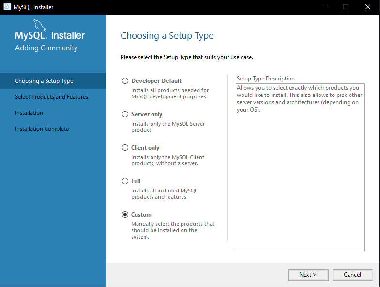
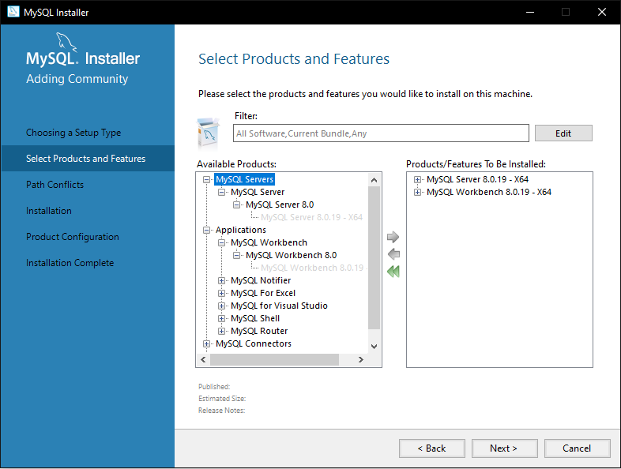
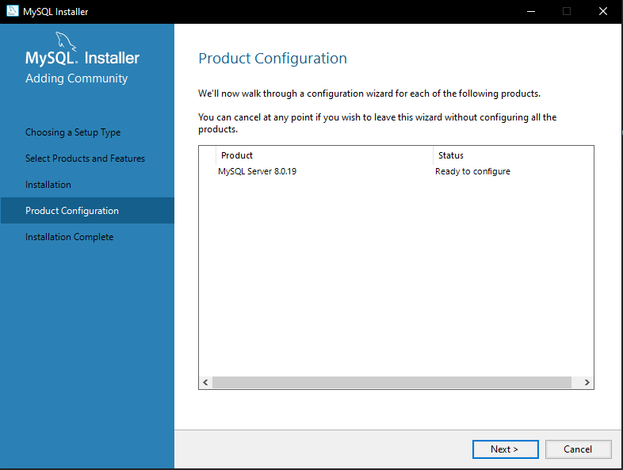
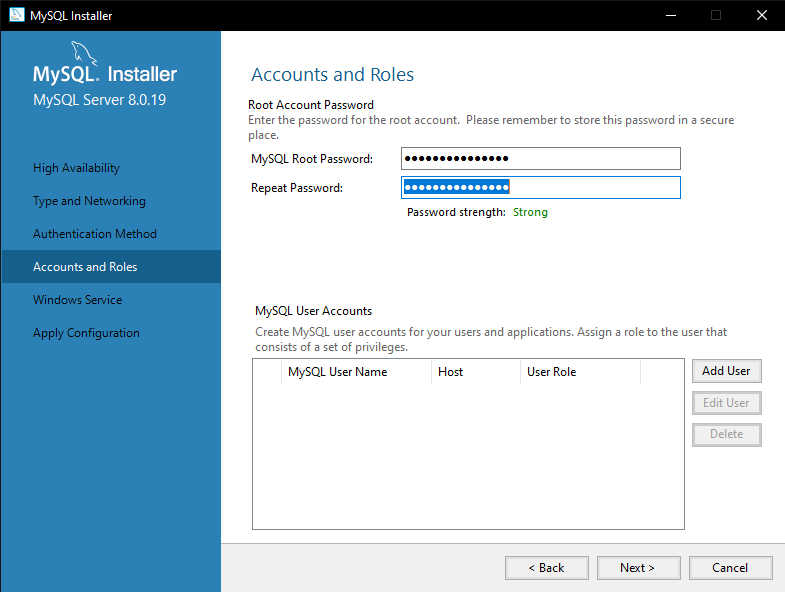

# MySQL on Windows

To use MySQL we need to install the MySQL Community Server.  
You can download it [here](https://dev.mysql.com/downloads/mysql/).  
If you'd like to know why we recommend MySQL over SQLite, please see [Alternate Databases.](../../info/alternate-databases#why-mysql)
***

## Download

Hit the "Go to Download Page" button and click on the **bottom** "Download" button. This is the offline installer, the top one is the web installer.  
After clicking you will be presented with a new page asking you to login or sign up. Do whatever you like here, but make sure you've also seen the "No thanks, just start my download." on the bottom left.

***

## Install

When the download is complete, run the installer and follow the steps below:

1. Choose a Setup Type  
Make sure Custom is selected and click Next.  
{: loading=lazy }  
1. Select Products and Features  
Select the following products to install:  
    - MySQL Server  
    - MySQL Workbench
Click on next to continue.  
{: loading=lazy }
1. Installation  
It could give you a message that some requirements are missing.  
This is fine, since it will install those requirements. Click Execute. When the installation is finished, click on next.  
{: loading=lazy }

## Configure

Click Next.  
{: loading=lazy }  

### High Availability

Make sure the Standalone MySQL Server is selected and click Next.  
{: loading=lazy }  

### Type and Networking

You now see the default settings.  
**Nothing _needs_ to be changed**, but you can change the port if needed. Make sure that you don't forget the port number in the database.json when you are going to migrate!  
Click Next.  
{: loading=lazy }  

### Authentication Method

We need to change the default setting to "Use Legacy Authentication Method".  
Since this _is_ a security risk I would advise closing the port (3306 default) in your modem.  
{: loading=lazy }  

### Account and Roles

We need to set a root password which allows us to connect to MySQL Server. This password is important, as it is needed for creating databases and potential future maintenance on it.  
Because of this, make sure you don't forget the password!  
We don't need to create users here - that's done in the migration process above.  
{: loading=lazy }  

### Windows Service

You can keep the default settings here and click on Next.  
{: loading=lazy }  

### Apply Configuration

Now it is time to actually apply all the configuration we just set. Hit Execute.  
{: loading=lazy }  

Once it is done, hit Finish.  
{: loading=lazy }  

***

### Using MySQL Workbench

In order to run the sql commands above, you'll need to use MySQL workbench.  
Hit start and type MySQL Workbench. Run the application.

{: loading=lazy }  

Click on the grey block which is named: "Local Instance". It will pop-up a box to enter your root password which you set in the installation of MySQL Server.  
Once you have entered the root password it will ask if you wanna store your password in the vault. I would recommend to do so, so you don't need to enter your root password again when you connect.

{: loading=lazy }  

You can now see the workbench which is displaying your MySQL server.  
Enter the queries/commands you wish to run into the query editor on screen, then click on the Lightning Bolt above the code to execute them.

{: loading=lazy }  

We are done with MySQL Server and the MySQL workbench. One quick tip is that on the left side (where you found Users and Privileges) there is a Dashboard.  
This will show you what kind of activity is running on your MySQL Server, and can be handy to check if Ombi has a connection or not.

***

## Migration Steps

Now that MySQL is installed, you can migrate your existing SQLite data to the new MySQL server to take advantage of the faster system.  
You can find a guide on this under [migrating databases.](../migrating-databases)
