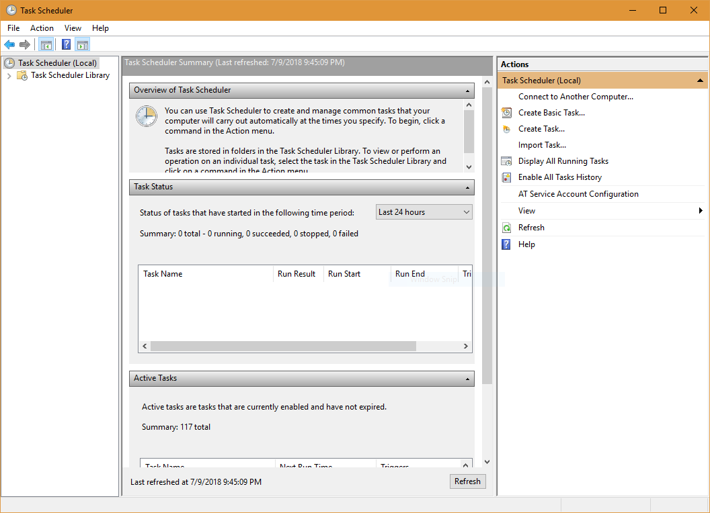
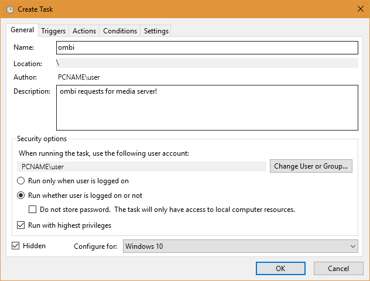
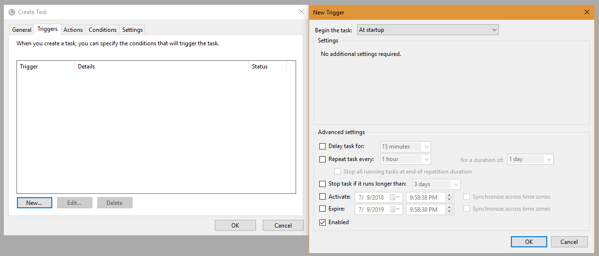
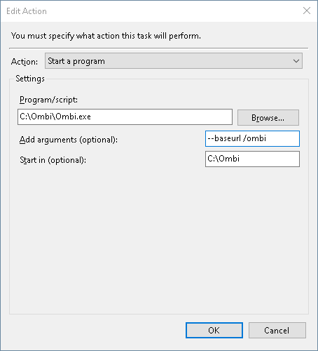
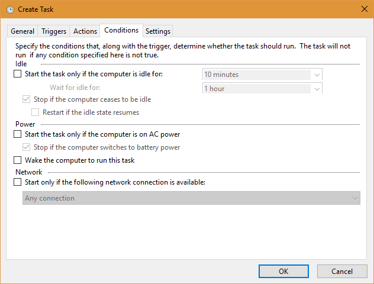
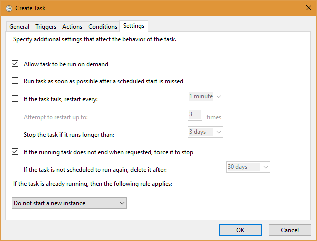

# Task Scheduler with Pictures

1. Open 'Task Scheduler'.  
 Either search for it in start, or simply Run...  
++win+r++ `%windir%\system32\taskschd.msc`  
2. Click `Create task...` on the right hand side.  
{: loading=lazy }  
3. Give the task a name.  
Example: Ombi  
Add a description _if you want_ (this is not required).  
{: loading=lazy }  
4. Check `Run with highest privileges`
5. Click `Run whether user is logged on or not` to ensure Ombi runs even when you are logged out!
6. Check `Hidden`  
{: loading=lazy }  
7. Configure for: (Choose your Windows version.)
8. Click the `Triggers` Tab and click `New...`
9. Begin the task: `At system startup`. Click `OK`.  
10. Click the `Actions` Tab and click `New...`  
{: loading=lazy }  
11. Click `Browse...` and navigate to your `Ombi.exe` Click `Open`
12. Fill `Start in (optional):` with Ombi.exe's working directory.  
IE: `C:\Ombi\` or `C:\SERVERS\Ombi\`. Basically, wherever you extracted your 'Ombi' folder to. Click `OK`  
12. Conditions: un-tick all, click 'OK'.
{: loading=lazy }  
13. Settings Tab: Untick `Stop the task if it runs longer than:`, then click `OK`.
{: loading=lazy }  
14. You will be prompted for your windows user name and password.  
Please enter your credentials, and click `OK`.

Either restart your PC for task scheduler to take over, or manually start it in the Task Scheduler Library on the far left.
