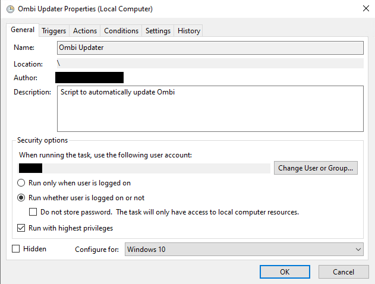

# Updating Ombi

## Automatic Updates

__*Note*__: The built-in automatic updater is broken for 'local' installations.  
The developer is aware of this, as is the support team. Current development is focused on a UI rewrite - once a viable cross-platform update method has been found, it will be implemented as a fix.  
Automated container updates via something like WatchTower for docker installs are unaffected - only direct installs using apt/exe deployment.  
If you have a suggestion for an update solution, feel free to either fork the project and submit a pull request, or submit a suggestion over on Discord.

### Watchtower (Docker)

There is an option in docker to use something called '[Watchtower](https://hub.docker.com/r/containrrr/watchtower)' to automatically update containers/images. If going this route we strongly suggest using a few extra arguments for both the Ombi container and the watchtower one.  
For the Ombi container, add a label to the container named `com.centurylinklabs.watchtower.enable`. Set it to `true`.  
For the Watchtower one, add a label to the container named `WATCHTOWER_LABEL_ENABLE`. Set it to `true`.

## Use Script (semi-automatic updates)

You can use your own update script here, please note that this will have to manage the termination and start of the Ombi process. You will have to terminate Ombi yourself.  

- carnivorouz - [v4 Linux systemd script](https://github.com/carnivorouz/updateOmbi)

### Script Path

The path to your script, we will automatically pass it the following arguments in the following order:

```bash
YourScript {UpdateDownloadUrl} --applicationPath {CurrentInstallLocation} --processname {ProcessName} --host {Ombi Host Argument} --storage {Ombi StoragePath Argument}
```

e.g.

```bash
Update.sh https://ci.appveyor.com/api/buildjobs/vxergo4kdyoaw929/artifacts/linux.tar.gz --applicationPath /opt/ombi --processname ombi --host http://*:5000 
```

This means the variables will be:  
{UpdateDownloadUrl}: $1  
{CurrentInstallLocation}: $3  
{ProcessName}: $5  
{Ombi Host Argument}: $7  
{Ombi StoragePath Argument}: $9  

The `{UpdateDownloadUrl}` is the Download that will contain either the .zip or .tar.gz file.  
`{Ombi Host Argument}` and `{Ombi StoragePath Argument}` are the args that you may have passed into Ombi e.g. `Ombi Host Argument` could be `http://*:5000` (They are optional)

## Manual Updates

It is possible to update Ombi manually.  
To do so is fairly straightforward.  

=== "SQLite"
    1. Stop Ombi. You can't do anything to it if the program is running.
        - If you're running Ombi as a service, stop the service.
        - If you're running Ombi manually, kill the process.
    2. Back up the database info from the Ombi directory.  
    There are 3 important db files (see what they do [here](../../info/faq/#database-uses)).  
        - Ombi.db
        - OmbiExternal.db
        - OmbiSettings.db  
    1. Delete the contents of the Ombi directory, _excluding_ the files mentioned in step 2.
    2. Download the latest `windows.zip`  from the link below:  
        [Stable](https://github.com/Ombi-app/Ombi/releases/latest)  
        [Develop](https://github.com/Ombi-app/Ombi/releases)
    3. Extract the zip to your Ombi directory.
    4. Start Ombi again.

=== "MySQL"
    1. Stop Ombi. You can't do anything to it if the program is running.
        - If you're running Ombi as a service, stop the service.
        - If you're running Ombi manually, kill the process.
    2. Back up the `database.json` file from the Ombi directory.  
    This defines how ombi connects to the MySQL server.
    1. Delete the contents of the Ombi directory, _excluding_ the files mentioned in step 2.
    2. Download the latest `win10-x86.zip` or `win10-x64.zip` from the link below:  
        [Stable](https://github.com/Ombi-app/Ombi/releases/latest)  
        [Develop](https://github.com/Ombi-app/Ombi/releases)
    3. Extract the zip to your Ombi directory.
    4. Start Ombi again.

## External Script (Windows)

Windows users who are running Ombi as a service can make use of a Powershell script to update their Ombi instance automatically.  
This script can be scheduled in Task Scheduler to run at whatever cadence you specify (daily is recommended).  
The script will check the current version of your Ombi instance against the latest release, and if the latest version is newer than the current installed version, the script will stop the Ombi service, download and install the update, and restart the service.  

This script only works for develop releases and should be considered __*beta*__.  
__*Do not use unless you know what you are doing*__.

You can download the script from [here.](../assets/scripts/Get-OmbiUpdate.ps1)  

### Installation and Use

- Back up your SQLite database and/or your database.json files from your Ombi installation. If something goes wrong with the automatic update script, these files may be deleted and will need to be recovered.
- The script deletes the contents of the Ombi folder during the update process. The update script must reside in its own folder, separate from your Ombi install folder. Do not put the script into the same folder or a subfolder within your Ombi install directory.  
- If you want to execute the script automatically using Task Scheduler, you must create a new task and fill out all the parameters as follows:  
    - Create a new task, with an informative name and description.  
    - Within the Triggers tab, set the task to execute at your desired cadence. Daily is recommended.  
    - Within the Action tab, create a new action. Set the task to Run whether user is logged on or not, and Run with highest privileges.  
    - In the Program/script field, enter the location of your Powershell executable.  
    This typically resides in `C:\Windows\System32\WindowsPowerShell\v1.0\powershell.exe`, but be sure to check the location for your system.  
    - If you are using the pre-compiled executable file, enter this file's path instead. If you are using the Powershell script, add the full path to the script as the first argument in the Add arguments field.  
    - Add all the remaining arguments (see instructions below) to the "Add arguments" field.  
    Be sure to surround all arguments in quotation marks, and escape any spaces in folder paths.  
    When executing the script using Task Scheduler, it is best to specify all arguments rather than relying on the default values.  
    - In the "Start in" field, enter the location of the script file or executable.  
    - When you are finished, you will be prompted to enter the credentials for the user account that the script/executable will be run using. You must use an Administrator account.  

{: loading=lazy }  

### Arguments

You will need to pass arguments to the script when calling it for it to work. The script must be run as an Administrator.  

- ApiKey  
This should be your API key for Ombi (found in your web interface). This is required.
- Ombidir  
This is the folder your copy of Ombi is running from. This is required.
- OmbiURL  
The address Ombi is listening on. This is required if you are using a non-standard port, IP, or baseurl. Defaults to `http://localhost:5000`.
- UpdaterPath  
This is where the script will download to. It's only required if you don't want them put in your downloads folder, as it defaults to a folder in your downloads folder.
- ServiceName  
Most of us just use 'Ombi', so it's the default. If you used something different, pass in this argument with whatever you used.
- Filename  
This is only for if you are using x86. If this is the case, pass in `Win10-x86.zip` as the argument. Default is `Win10-x64.zip`.  
- Force  

This is a simple true/false switch - it will force the script to install the newest version, even if it's already installed. If the argument isn't there, it's a `false`. The moment you add `-Force` to the end of the command you'd normally use to run this script, it'll be `true` and force a reinstall.

To pass arguments to a Powershell script, you name them when calling the script using the following syntax:  
`script -parametername 'parametervalue' -parameter2name 'parameter2value`  

### Troubleshooting

If you have difficulty getting the script/executable working, you can test the script by opening a command prompt in the folder where your script is located.  
Double check that you have backed up your SQLite database and/or database.json file before proceeding.  

Copy the full path to Powershell or the executable version of the script, then copy all the parameters used in the Scheduled Task into the same command. Execute the command and take note of the output.
