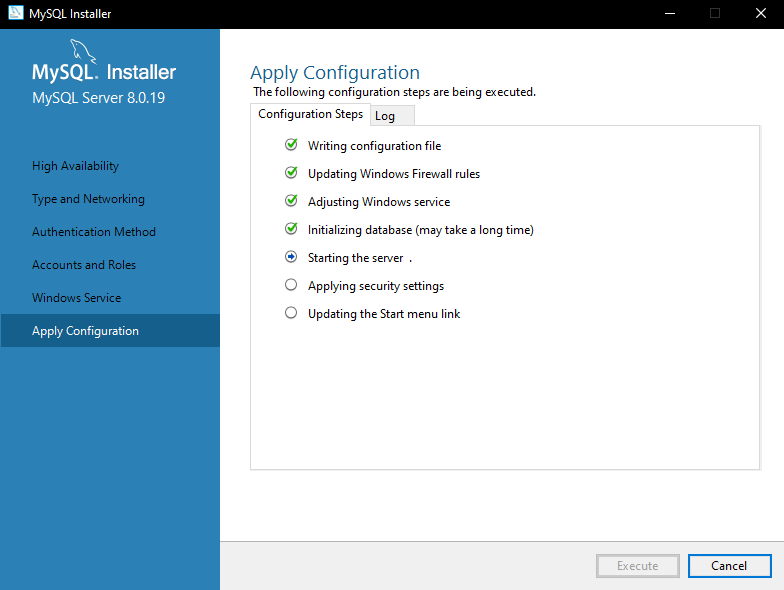

# Alternate Database Options

Ombi supports multiple database types, not just sqlite.  
The way this works is that Ombi looks for a `database.json` file in the installation directory (or, if you specified a `Storage Path` at startup, in that location e.g. AppData).  
If the file is not found then Ombi falls back to the default, creating or using existing SQLite databases in the Ombi directory.

## database.json

The `database.json` file needs to look like the below example (replacing usernames, passwords, and server addresses to match your own mysql server as needed).

```json
{
    "OmbiDatabase": {
        "Type":"MySQL",
        "ConnectionString":"Server=192.168.1.7;Port=3306;Database=Ombi;User=ombi;Password=ombi"
    },
    "SettingsDatabase": {
        "Type":"sqlite",
        "ConnectionString":"Data Source=C:/tmp/Settings.db"
    },
    "ExternalDatabase": {
        "Type":"sqlite",
        "ConnectionString":"Data Source=C:/tmp/External.db"
    }
}
```

As you can see you can specify a database type and a connectionstring per database that Ombi has.
You can see what each database is used for [here](../faq/#database-uses).

***

## Supported Databases

| Type | ConnectionString Example |
| ---- | -----------------|
| SQLite |    Data Source=C:/tmp/Ombi.db |
| MySQL/MariaDB  |   Server=localhost;Database=Ombi;User=root;Password=123456; |

### SQLite

The default. This requires no database.json file, and checks for the relevant db files in the application directory.  

### MySql/MariaDB

Supported versions:  
[https://github.com/PomeloFoundation/Pomelo.EntityFrameworkCore.MySql#supported-dbms-and-versions](https://github.com/PomeloFoundation/Pomelo.EntityFrameworkCore.MySql#supported-dbms-and-versions)

Please ensure that your database character set is set to `utf8mb4`.  
You can check your db charset by running the following query:  
`show variables like 'character_set_database';`  
You can use a separate database per function (like sqlite does, with the 3 db files), or point all of them at the same mysql database, as each table has a unique name regardless.  
_It is up to you whether you use separate databases for each. For people unfamiliar with mysql, it is much easier to drop a database than to drop specific tables._

#### Single Database

This example shows using a single mysql "ombi" database for all 'sub' databases (tables).  

```json
{
  "OmbiDatabase": {
    "Type": "MySQL",
    "ConnectionString": "Server=localhost;Port=3306;Database=Ombi;User=ombi;Password=ombi"
  },
  "SettingsDatabase": {
    "Type": "MySQL",
    "ConnectionString": "Server=localhost;Port=3306;Database=Ombi;User=ombi;Password=ombi"
  },
  "ExternalDatabase": {
    "Type": "MySQL",
    "ConnectionString": "Server=localhost;Port=3306;Database=Ombi;User=ombi;Password=ombi"
  }
}
```

#### Multiple Databases

This example shows using a separate mysql database for each 'sub' database (tables).  

```json
{
  "OmbiDatabase": {
    "Type": "MySQL",
    "ConnectionString": "Server=localhost;Port=3306;Database=Ombi;User=ombi;Password=ombi"
  },
  "SettingsDatabase": {
    "Type": "MySQL",
    "ConnectionString": "Server=localhost;Port=3306;Database=Ombi_Settings;User=ombi;Password=ombi"
  },
  "ExternalDatabase": {
    "Type": "MySQL",
    "ConnectionString": "Server=localhost;Port=3306;Database=Ombi_External;User=ombi;Password=ombi"
  }
}
```

#### Create database and user

On the MySQL/MariaDB server we will create the database and the user that we will use later.  
_You need to_ `GRANT ALL PRIVILEGES` _for every database you create._

This is done in the mysql console (or phpmyadmin if you have that configured).

##### Single Database permissions

```mysql
CREATE DATABASE IF NOT EXISTS `Ombi` DEFAULT CHARACTER SET utf8mb4 COLLATE utf8mb4_bin;
CREATE USER 'ombi'@'%' IDENTIFIED BY 'ombi';
GRANT ALL PRIVILEGES ON `Ombi`.* TO 'ombi'@'%' WITH GRANT OPTION;
```

##### Multiple Database permissions

```mysql
CREATE DATABASE IF NOT EXISTS `Ombi` DEFAULT CHARACTER SET utf8mb4 COLLATE utf8mb4_bin;
CREATE DATABASE IF NOT EXISTS `Ombi_Settings` DEFAULT CHARACTER SET utf8mb4 COLLATE utf8mb4_bin;
CREATE DATABASE IF NOT EXISTS `Ombi_External` DEFAULT CHARACTER SET utf8mb4 COLLATE utf8mb4_bin;
CREATE USER 'ombi'@'%' IDENTIFIED BY 'ombi';
GRANT ALL PRIVILEGES ON `Ombi`.* TO 'ombi'@'%' WITH GRANT OPTION;
GRANT ALL PRIVILEGES ON `Ombi_Settings`.* TO 'ombi'@'%' WITH GRANT OPTION;
GRANT ALL PRIVILEGES ON `Ombi_External`.* TO 'ombi'@'%' WITH GRANT OPTION;
```

***

#### Functionality

So long as:

- `database.json` exists
- The details within it are correct
- The database(s) exist
- The user(s) exist

Restarting ombi should generate the tables and start up ombi like it would normally.

_This will not migrate any existing settings._  
You effectively have a clean ombi install.

#### Migration

You can migrate the existing sqlite databses to mysql if you choose by following the [Migration Guide](../../guides/migrating-databases)

## Installing MySQL on Windows

For installing MySQL we need to install the MySQL Community Server.  
You can download it [here](https://dev.mysql.com/downloads/mysql/).
***

### Download

Hit the "Go to Download Page" button and click on the **bottom** "Download" button. This is the offline installer, the top one is the web installer.  
After clicking you will be presented with a new page asking you to login or sign up. Do whatever you like here, but make sure you've also seen the "No thanks, just start my download." on the bottom left.

***

### Install

When the download is complete, run the installer and follow the steps below:

1. Choose a Setup Type  
Make sure Custom is selected and click Next.  
  
1. Select Products and Features  
Select the following products to install:  
    - MySQL Server  
    - MySQL Workbench
Click on next to continue.  

1. Installation  
It could give you a message that some requirements are missing.  
This is fine, since it will install those requirements. Click Execute. When the installation is finished, click on next.  


### Configure

Click Next.  
  

#### High Availability

Make sure the Standalone MySQL Server is selected and click Next.  
  

#### Type and Networking

You now see the default settings.  
**Nothing _needs_ to be changed**, but you can change the port if needed. Make sure that you don't forget the port number in the database.json when you are going to migrate!  
Click Next.  
  

#### Authentication Method

We need to change the default setting to "Use Legacy Authentication Method".  
Since this _is_ a security risk I would advise closing the port (3306 default) in your modem.  
  

#### Account and Roles

We need to set a root password which allows us to connect to MySQL Server. This password is important, as it is needed for creating databases and potential future maintenance on it.  
Because of this, make sure you don't forget the password!  
We don't need to create users here - that's done in the migration process above.  
  

#### Windows Service

You can keep the default settings here and click on Next.  
  

#### Apply Configuration

Now it is time to actually apply all the configuration we just set. Hit Execute.  
  

Once it is done, hit Finish.  
  

***

#### Using MySQL Workbench

In order to run the sql commands above, you'll need to use MySQL workbench.  
Hit start and type MySQL Workbench. Run the application.

  

Click on the grey block which is named: "Local Instance". It will pop-up a box to enter your root password which you set in the installation of MySQL Server.  
Once you have entered the root password it will ask if you wanna store your password in the vault. I would recommend to do so, so you don't need to enter your root password again when you connect.

  

You can now see the workbench which is displaying your MySQL server.  
Enter the queries/commands you wish to run into the query editor on screen, then click on the Lightning Bolt above the code to execute them.

  

We are done with MySQL Server and the MySQL workbench. One quick tip is that on the left side (where you found Users and Privileges) there is a Dashboard.  
This will show you what kind of activity is running on your MySQL Server, and can be handy to check if Ombi has a connection or not.

***
