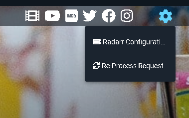

--8<-- "assets/glossary.md"

If you feel like a question should be added please reach out via the [Ombi Discord.](https://discord.gg/Sa7wNWb)  
See also: [Known Faults](known-faults), [Common Errors](common-errors)

***

## How do I request a feature be added to Ombi

See [Feature Suggestions](../../guides/feature-suggestions)
***

## What is the Plex connection used for

1) It allows for using oAuth sign-in (so users don't have to add _another_ password to the mix).
1) It allows for checking for actual availability (not just in place according to *arr, but indexed in a library and actually watchable).
1) It allows for Ombi to use a plex ID for the link in newsletters etc - so users can click the notification and be taken directly to the item in Plex.

## Can I synchronise users between Ombi and Tautulli?

Yes, you can.  
This is a little more involved than some people are comfortable with, as it's not officially supported.  
If that doesn't worry you, and you're comfortable with running custom scripts and Python code, then you can check out the script created by DirtyCajunRice [here](../info/ombi-tautulli.md).
***

## How do I get the QR code for mobile connections?

Ensure that the [application URL](../../settings/customization/#application-url) has been entered.  
***

## Database uses

There are 3 databases that Ombi uses.

=== "Ombi"

    This contains Ombi specific information  
    e.g. Users, Requests, Issues

=== "OmbiExternal"

    This contains the information we take from external providers  
    e.g. Plex Server Content, Radarr Content, Sonarr Content

=== "OmbiSettings"

    This contains all of the settings that you have applied to Ombi  
    e.g. Notification Preferences, SMTP Settings, Sonarr Settings, Plex Settings

***

## How can I include Ombi logs in Logarr?

Because Ombi adds the date into the name of the log file, you can't hard-code to the latest log file - the link will be incorrect the next day.  
Instead, we can use the php date() function and string concatenation (.) to build the path on the fly when we are in Logarr.  
The logs are named in the format `log-yyyymmdd.txt` - so January 14, 2019 would be `log-20190114.txt`. php date(Ymd) gives us the date in that format, and we can concatenate it into our ombi log path in Logarr configs like so:  
_(**Note**: change folder paths to match your own install directory of Ombi.)_  

```php
"Ombi" => 'C:\Services\Ombi\Logs\log-' . date("Ymd") . '.txt',
```

_You can also use similar code for any software which hard-codes the date into the config. It's not uncommon._

***

## Can I force requests to re-add to client systems?

Some people make the mistake of letting users request content before they configure the client systems to receive the requests (Sonarr/Radarr/CouchPotato/SickRage/Lidarr etc).  
To force Ombi to attempt to re-process the request (and send it to the relevant system):

=== "The UI Way"
    1. Open Ombi.
    2. Click "Requests" (left hand menu).
    3. Find the relevant request in the lists.
    4. Click "Details".
    5. Click the little gear icon (top right).
    6. Click "Re-Process Request".

    

=== "The SQL way (unsupported)"
    In older versions of Ombi, there was no way to force the software to 're-add' the requested item to the downloader/monitoring system.  
    To achieve this, you would need to open the Ombi.db file and execute commands on it manually (Ombi will need to be stopped for this to work), marking the relevant requests as "needs approval" via an SQL command.  
    This would allow you to then click "approve" and have Ombi add the request to the relevant application and continue as normal.  

    _**Note:** this is not supported officially and carries risks._  
    The relevant commands are:  

    ```sql
    UPDATE AlbumRequests
    SET Approved = 0
    WHERE Approved = 1 AND Available = 0;

    UPDATE ChildRequests
    SET Approved = 0
    WHERE Approved = 1 AND Available = 0;
    UPDATE EpisodeRequests
    SET Approved = 0
    WHERE Approved = 1 AND Available = 0;

    UPDATE MovieRequests
    SET Approved = 0 
    WHERE Approved = 1 AND Available = 0;
    ```

***

## TV shows and episodes not showing as available

The most common reason for this is that we require TVDB information to match against, and your TV library in Plex probably doesn't have this metadata information.
To fix this you need to ensure your TV Library in Plex is using an agent that provides this ID. We suggest "TheTVDB".  
Edit Library > Advanced > Agent = TheTVDB

Refresh the metadata for that library, and next time the Plex Sync job runs it should pick up that the content now has TheTVDB Id's!
***

## Notifications are not sending, but mass email works

Before any notifications will work properly you'll need to ensure you have configured your application URL under Settings -> Customization.  
This is due to Ombi needing to know where to send users if they click any links within the notifications.
***

## Notifications for requests not being received

1. Check and test if you have configured the notification(s) as per instructions in [Discord Notification Settings](../../settings/notifications/discord) and [Email Notification Settings](../../settings/notifications/email)
2. If testing the notification(s) work fine then make sure that the user requesting is not an auto approve or admin user

***

## Ombi does not default to English or my preferred language

Once you have set your preferred language in the user preferences area of Ombi, then it's attached to your user profile. When Ombi loads up, it checks what was set and will use that. If nothing has been set then Ombi sets whatever is the first language your browser presents to it.  
If this does not get presented properly, this is mostly an issue with Chrome.  
You can run the command `navigator.languages` in the Chrome console to see the list.  
To get Ombi to display the language you want, make that language appear as the first entry in the above command.

You can do this by:

- Open the Chrome Language Settings page  
`chrome://settings/languages`
- Click the down arrow next to Language
- Click the 3 ellipses by the language you want to set as default
- Click move to the top.

Please set Chrome to use this as display language as well.
***

## How do I enable debug logging?

In order to enable debug logging in Ombi, you'll need to edit a file called `appsettings.json`.  
In most cases, this is in the application directory. In a docker container, this is in /app/ombi _inside the container_.  

Change the `Default` entry under `LogLevel` from "Warning" to "Debug".  
You will need to restart Ombi after changing the file for the changes to apply.  

_Do not forget to disable debug logging once you are done - it is for troubleshooting, and should not be left enabled full-time._

=== "Default Logging"
    ```json
    "Logging": {
        "IncludeScopes": false,
        "LogLevel": {
        "Default": "Warning",
        "System": "Warning",
        "Microsoft": "Warning",
        "Hangfire": "None",
        "System.Net.Http.HttpClient.health-checks": "Warning",
        "HealthChecks": "Warning"
        }
    },
    "Serilog": {
        "MinimumLevel": "Warning"
    },
    ```

=== "Debug Logging"
    ```json
    "Logging": {
        "IncludeScopes": false,
        "LogLevel": {
        "Default": "Debug",
        "System": "Debug",
        "Microsoft": "Warning",
        "Hangfire": "None",
        "System.Net.Http.HttpClient.health-checks": "Warning",
        "HealthChecks": "Warning"
        }
    },
    "Serilog": {
        "MinimumLevel": "Debug"
    },
    ```

=== "Trace Logging"
    ```json
    "Logging": {
        "IncludeScopes": false,
        "LogLevel": {
        "Default": "Trace",
        "System": "Trace",
        "Microsoft": "Trace",
        "Hangfire": "None",
        "System.Net.Http.HttpClient.health-checks": "Warning",
        "HealthChecks": "Warning"
        }
    },
    "Serilog": {
        "MinimumLevel": "Trace"
    },
    ```
