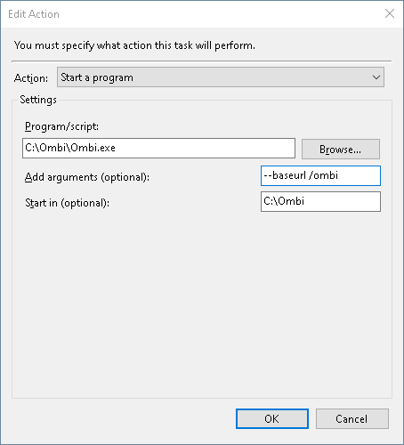

# Startup Parameters

Certain parameters (or _arguments_) can be passed to the ombi application to enforce specific settings.  
The available options are the same across all platforms (Mac, Windows, Linux etc), but in some instances actually using them differs.  
This page is intended to help with some rough information on how to use them on different platforms.  
To jump to how they're used, click [here](#usage).  

## Parameters

Below you'll find each available parameter, and what they do.  

### --host

This should be a semicolon-separated (;) list of URL prefixes to which the server should respond.  
For example, `--host http://localhost:123;http://ip.of.ombi.host:123`.  
Use "\*" to indicate that the server should listen for requests on any IP held by the system it's installed on using the specified port and protocol.  
For example, `--host http://*:5000` would listen on localhost, the machine IPv4 address, and the IPv6 address.  
The protocol (http:// or https://) **must** be included with each URL.  
Note: if behind a reverse proxy, Ombi should use `http://` as the proxy will handle the "s" part.  
Default = `http://*:5000`

### --storage

Storage path, where we save the logs and database.  
The default for this differs slightly by OS. On Windows, this is the application directory. On Linux, this is `/opt/ombi`.  

### --baseurl

The base URL for reverse proxy scenarios. See [reverse proxying](../../info/reverse-proxy) for more info.  
Note that this _**MUST**_ begin with a "/" character (i.e. `/ombi`, not `ombi`).

### --demo

Demo mode. You will _never_ need to use this, and we don't like that fruit company...

### --migrate

Will run any database migrations that have not been run on your database and then exit the application.  

### --help

Display a help screen listing these startup options.

### --version

Display version information.

## Usage

This is not an exhaustive or comprehensive guide, but should provide a rough idea for using parameters on the different platforms Ombi works on.

### Windows

This varies depending on whether you run it manually, via task scheduler, or via nssm as a service.

=== "Manual run"
    * When launching Ombi by simply double-clicking the file, you cannot pass in any startup parameters.
    * If you are using CMD (or another terminal, like PowerShell) to launch Ombi, simply add the parameter after the filename for Ombi, as shown below.
    * If you are using a script to launch ombi, or a shortcut, add the parameters _after_ the path to the Ombi file is called.

    {: loading=lazy }  

=== "Scheduled task"
    Parameters on a scheduled task go into the "action" for the task, under `Add Arguments (optional)`.  

    {: loading=lazy }

=== "NSSM"
    When installing Ombi via nssm, or switching to a baseurl from an existing install, you will need to edit your service to include the parameters.  
    With nssm, this can be done during install (`nssm install ombi`) or after initial install (`nssm edit ombi`).  
    Parameters should be put into the "arguments" field in nssm, as shown below.  

    {: loading=lazy }  

### Mac

Coming soon.

### Linux

This one has a lot of variety involved, so a few common options will be broken down here.  
For most 'nix variants, Ombi will run as a service (especially when installed via the apt repo), so the _service_ file itself will need editing to include the parameters to be used at launch each time.

=== "Apt Repo"
    You'll need to edit the ombi service file, usually located at `/lib/systemd/system/ombi.service`.
    Edit the line that reads `ExecStart=/opt/Ombi/Ombi --storage /etc/Ombi/`, and add `--baseurl /ombi` to the end (or your preferred baseurl).  
    The resulting line should look similar to this: `ExecStart=/opt/Ombi/Ombi --storage /etc/Ombi/ --baseurl /ombi`.  
    Restart the ombi service to apply this change (`sudo service ombi restart`).

### Docker

This varies depending on the package maintainer (hotio or linuxserver). Generally, the parameters can be passed in as ENV variables - however this should be confirmed with the package maintainer directly.
