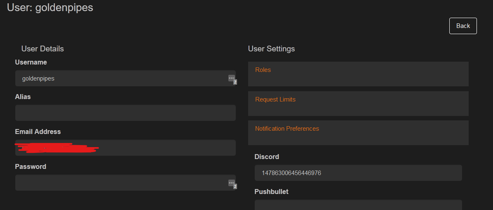

# Discord Notifications

Ombi can be set up to send notifications to a Discord server for request states.

## Configuring access to the channel

You must have a webhook set up for your chosen discord server or channel.  
You can find an official guide for this [here](https://support.discordapp.com/hc/en-us/articles/228383668-Intro-to-Webhooks).

## Enabling Mentions

1. Set the user's 'Notification Preferences' to the person's discord user ID.  
This can be found by right clicking their name in Discord and selecting "Copy ID".  
(Only visible while in Developer Mode - this can be enabled under "Settings > Advanced".)  
{: loading=lazy }
2. Add `<@{UserPreference}>` where you want to mention in your notification template.  
Refer to the [Notification Template Variables](../../../info/notification-template-variables) for information on formatting your notifications.

Extra tips:  
You can set a channel so nobody can post, and the webhook can still post.  
You can @ people by using: `<@{Alias}>!`. Be sure their Discord alias is known in the user profile of Ombi under Alias.  
