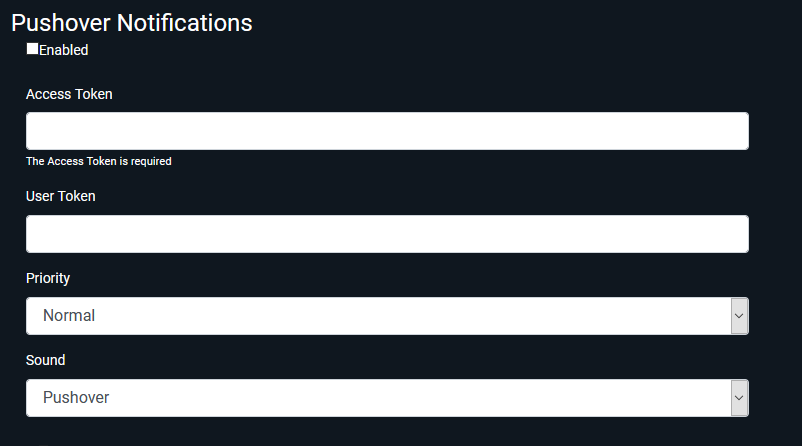

# Pushover

For configuring notifications to be sent via [Pushover](https://pushover.net/).

## Enabled

Turns this notification type on or off at a system level.  

## Access Token

This is a Pushover API token, and can be created on their build page.  
Find it [here.](https://pushover.net/apps/build)

## User Token

When you sign up to Pushover you'll get a User Key e-mailed to you, but you can always find it either [on your dashboard](https://pushover.net/dashboard) or through the Settings menu of the Pushover client app on your device.  
The User Key is a randomly generated identifier which allows other apps to send Pushover notifications to your devices.

## Priority

Lets you define how high a priority to assign to Ombi notifications in Pushover.  
Note, setting this to high _may_ override some silencing profiles, so be careful here.  

## Sound

This lets you set a custom notification tone to use for notifications from Ombi.

## Screenshot

{: loading=lazy }
