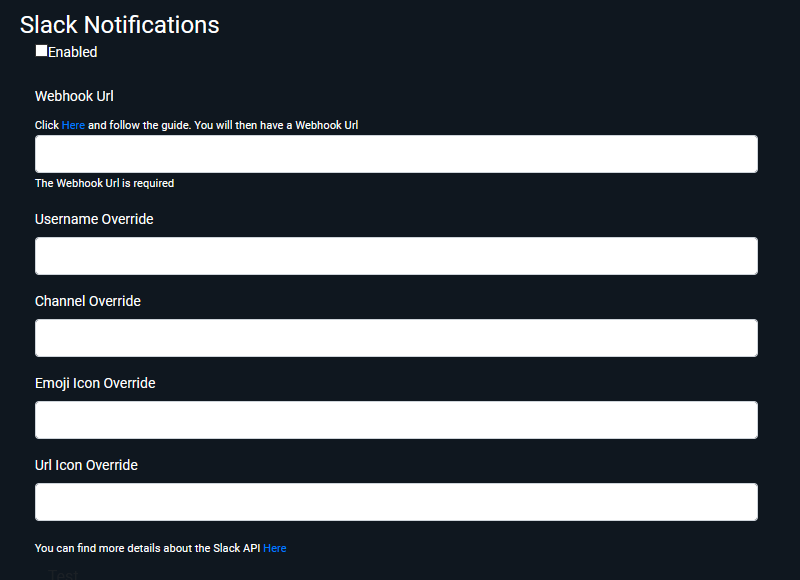

# Slack Notifications

Here is where you can configure Ombi to send notifications to a Slack server.  

## Coming Soon

## Enabled

Turns this notification type on or off at a system level.  

## Webhook Url

You'll need to configure a webhook in your particular Slack instance. Find this [here.](https://my.slack.com/services/new/incoming-webhook/)  
Once you have this webhook address, enter it into the Webhook Url field and press Submit to save it. This is where Ombi will submit the notification details

## Username Override

_More info coming soon._

## Channel Override

_More info coming soon._

## Emoji Icon Override

_More info coming soon._

## Url Icon Override

_More info coming soon._

## Screenshot

{: loading=lazy }
