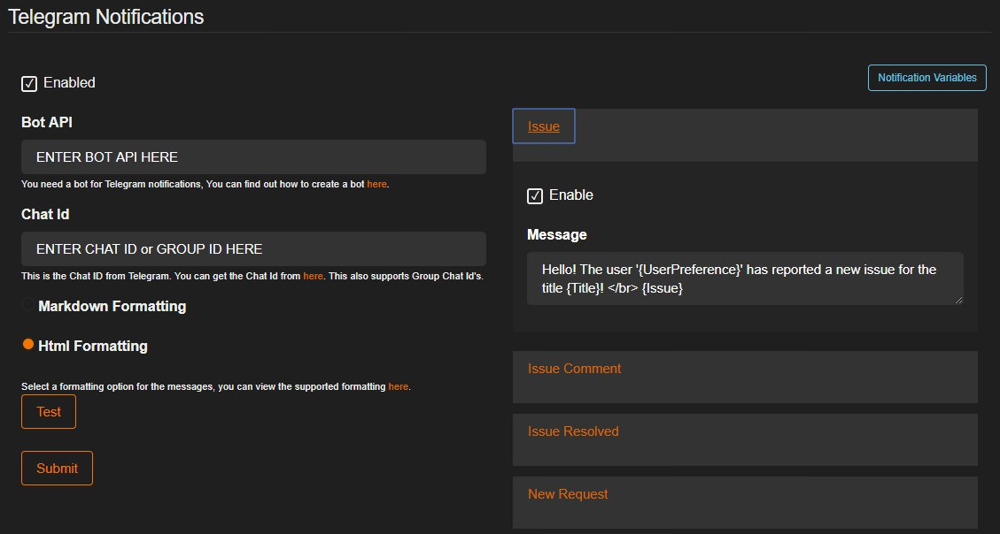
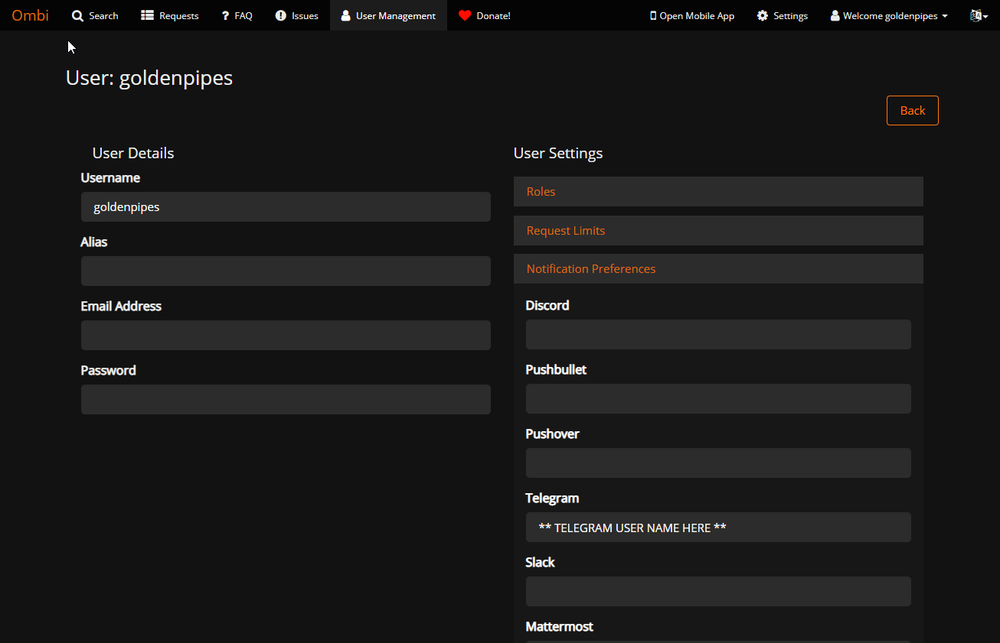
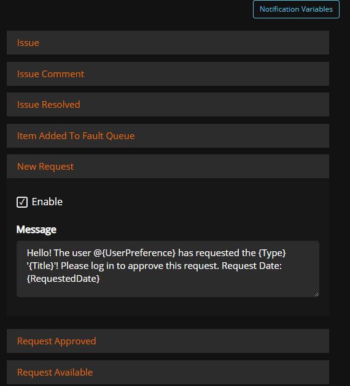

# Telegram Notifications

## Bot Needed

You need a bot for Telegram notifications.  
Visit Telegram and create a bot [here](https://core.telegram.org/bots#6-botfather).

## Ombi Settings

You also need a Chat ID from Telegram. You can get the Chat ID from [here](https://telegram.me/get_id_bot).  
This also supports Group Chat ID's.

## Tagging Users

You can also add [UserPreference](../template-variables) to Telegram!  
In the User Management settings, Enter each users Telegram Username into the field.

In order for the notification to call a user you must add `@{UserPreference}` as a [Notification Variable](../template-variables) into the Notification Settings, as pictured.  

